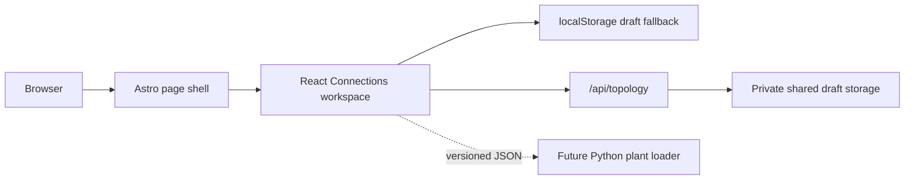

# ICARUS Web

### Arm Create 2026 | Physical AI track

> A visible, editable interface for the ICARUS ventilation simulation: define a habitat topology now, then connect it to local fault inference and bounded virtual recovery.

[](https://astro.build/)
[](https://react.dev/)
[](https://arm-ai-optimization-challenge.devpost.com/)

ICARUS is a simulation-first Physical AI prototype for the Arm Create AI Optimization Challenge 2026. This repository contains the standalone web interface. Its first live layer is **Connections**, a graph workspace where the team can define rooms, processing areas, and directed airflow actuators before the topology is consumed by the Python simulation.

The interface makes the future control loop tangible:

```text
simulated plant -> telemetry -> local fault inference -> safety governor -> bounded virtual actuation
       ^                                                                    |
       +---------------- changed plant state and replay -------------------+
```

The current website is deliberately honest about its boundary: it edits a versioned simulation topology. It does not control real spacecraft, life-support, HVAC, or production equipment.

## Why ICARUS

Physical AI systems are easier to trust when their environment, signals, decisions, and recovery actions can be inspected together. ICARUS starts with the system map itself. A room is not just a label, and an actuator is not just a line on a diagram: both carry configurable domain bias that the later plant model and safety logic can consume.

The web experience gives the team a shared visual language for the proof loop before model inference and Arm benchmark evidence are added.

## What is live

- **Connections workspace** - four-room starter topology with crew cabins, a lab, and an air-processing bay.
- **Directed actuators** - add one-way airflow paths or paired return paths with independent state.
- **Editable domain bias** - configure occupants, generation, capacity, effectiveness, commandability, notes, and tags.
- **Draft workflow** - save named drafts locally, import/export versioned JSON, reset changes, and delete drafts with confirmation.
- **Optional shared drafts** - synchronise through a private Vercel Blob store when deployment storage is connected.
- **Responsive interface** - usable on desktop, 4K displays, tablets, and mobile widths with labelled controls.
- **Clear roadmap states** - Live system, Scenarios, Telemetry, and Benchmarks are visible as planned layers rather than presented as finished functionality.

## Architecture



The graph document is intentionally independent of React Flow internals. That keeps visual layout concerns such as node position separate from the serializable topology that the simulator will eventually load.

## The graph contract

Every topology is stored as a versioned document. A simplified example:

```json
{
  "version": 1,
  "name": "Habitat circulation / draft 01",
  "nodes": [
    {
      "id": "cabin-a",
      "label": "Crew Cabin A",
      "preset": "crew_cabin",
      "position": { "x": 80, "y": 100 },
      "bias": { "occupants": 1, "co2_generation": 1.0 }
    }
  ],
  "connections": [
    {
      "id": "cabin-a-to-processing-bay",
      "source": "cabin-a",
      "target": "processing-bay",
      "preset": "fan",
      "bias": { "capacity": 10.0, "effectiveness": 1.0, "commandable": true }
    }
  ]
}
```

Stable IDs, editable labels, directional connections, configurable bias, and a schema version are the important boundaries. The visual editor can evolve without forcing the Python simulator to understand React Flow objects.

## Technology

| Layer | Choice | Purpose |
| --- | --- | --- |
| Page shell | [Astro](https://astro.build/) | Fast deployable pages and server endpoint support |
| Interactive UI | [React](https://react.dev/) | Stateful topology editing island |
| Graph canvas | [React Flow](https://reactflow.dev/) | Nodes, directed edges, selection, handles, and minimap |
| Validation | [Zod](https://zod.dev/) | Versioned graph document boundary |
| Icons and type | [Lucide](https://lucide.dev/), Space Grotesk, IBM Plex Mono | Compact controls and technical interface hierarchy |
| Shared storage | [Vercel Blob](https://vercel.com/docs/storage/vercel-blob) | Optional private draft persistence |

## Project structure

```text
icarus-web/
├── public/                 # Public project brief and static assets
├── src/
│   ├── components/         # React islands and interface styles
│   ├── layouts/            # Astro page shell
│   ├── lib/                # Graph contract and navigation data
│   ├── pages/              # Routes and /api/topology
│   └── styles/             # Global theme tokens and typography
├── .env.example            # Safe environment variable names only
├── astro.config.mjs        # Astro and Vercel adapter configuration
├── package.json
└── README.md
```

Generated directories such as `node_modules`, `.astro`, `dist`, and `.vercel` are intentionally ignored.

## Run locally

Use the repository root as the working directory:

```powershell
npm install
npm run check
npm run dev -- --host 127.0.0.1 --port 4321
```

Open `http://127.0.0.1:4321`. The website works without a backend. Drafts use browser storage, JSON import/export remains available, and the shared API reports that Blob storage is not configured until credentials are added.

Before sharing a change, run the production checks:

```powershell
npm run check
npm run build
npm run preview
```

To stop the Astro development server, run this separately:

```powershell
npx astro dev stop
```

## Safety boundary

ICARUS is a research simulation for a hackathon. The values in the current model are abstract units, not spacecraft measurements or operational safety thresholds. The deployed prototype has no user accounts or authentication, so anyone with the site URL can potentially overwrite or delete shared drafts when Blob storage is enabled. Add authentication, authorization, and optimistic concurrency before using shared storage beyond a controlled demonstration.

## Roadmap

- Connect the graph document to a generalized Python plant model.
- Add live telemetry and the primary-fan degradation scenario.
- Add local fault inference with reproducible FP32 and INT8 benchmark evidence on Arm.
- Add a deterministic safety governor, bounded redundant-fan actuation, and the `HAND_BACK` path.
- Add recovery traces that prove a virtual command changes the simulated plant state.

## Links

- [Arm Create AI Optimization Challenge](https://arm-ai-optimization-challenge.devpost.com/)
- [Arm learning paths](https://learn.arm.com/)
- [Astro](https://astro.build/)
- [React Flow](https://reactflow.dev/)
- [Vercel Blob](https://vercel.com/docs/storage/vercel-blob)

## Team

Built by Alex, Ben, and MS-Mesh for the Arm Create 2026 Physical AI track.
